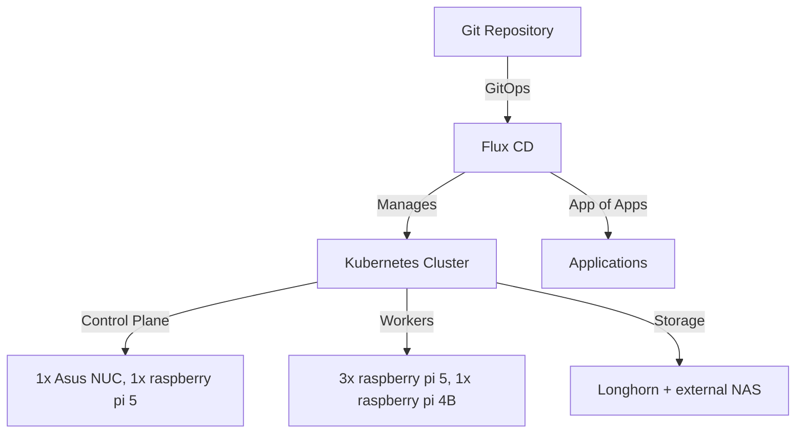

# 🏠 Home Lab Kubernetes Cluster


A bare-metal Kubernetes cluster running on TalOS Linux.

In my [Arcitectural decision record](./docs/arch-decisions/README.md) you can find my reasoning for design decision I take on my kubernetes cluster.

## Infrastructure Overview

### Hardware
- **Control Plane**: 1x Asus NUC 14 Pro, 1x raspberry pi 5
- **Worker nodes**: 3x raspberry pi 5, 1x raspberry pi 4B
- **Storage**: NVMe SSDs + ZFS Raid hard drives

### Software Stack
- **Base OS**: Talos Linux
- **Container Orchestration**: Kubernetes
- **GitOps Engine**: Flux CD
- **Storage**: Longhorn

### Network Stack
- **CNI**: Cilium
- **DNS**: CoreDNS
- **Certificates**: Let's encrypt

## Key Features

- **GitOps**: Apps-of-apps pattern, managed with FluxCD
- **Declarative Configuration**: Everything-as-code philosophy
- **Persistent Storage**: Longhorn SSD block storage for random R/W. TBD - NAS ZFS Raid for long-term storage

## 🏛️ Architecture


```mermaid
graph TD
    A[Git Repository] -->|GitOps| B[Flux CD]
    B -->|Manages| C[Kubernetes Cluster]
    C -->|Control Plane| D[1x Asus NUC, 1x raspberry pi 5]
    C -->|Workers| E[3x raspberry pi 5, 1x raspberry pi 4B]
    C -->|Storage| F[Longhorn + external NAS]
    B -->|App of Apps| G[Applications]
```

## Security

Scan cluster for with [kubescape](https://github.com/kubescape/kubescape) to detect vulnerabilities and misconfiguration.

---

## Asdf package manager
This repo use the ASDF package manager. You can use it to easily installed the CLI tools needed for this repo, or you can download them another way, check [.tool-versions](./.tool-versions).

Install it with your favourite package manager, then add the following repos:

```bash
# Add repos
asdf plugin-add kubeseal https://github.com/stefansedich/asdf-kubeseal &&
asdf plugin-add cilium-cli https://github.com/carnei-ro/asdf-cilium-cli.git &&
asdf plugin-add cilium-hubble https://github.com/NitriKx/asdf-cilium-hubble.git &&
asdf plugin-add helm https://github.com/Antiarchitect/asdf-helm.git &&
asdf plugin add k9s https://github.com/looztra/asdf-k9s.git &&
asdf plugin-add flux2 https://github.com/tablexi/asdf-flux2.git &&
asdf plugin-add kustomize https://github.com/Banno/asdf-kustomize.git &&

# Install
asdf install
```

---

# Other information:

## Monitoring CPU temps

https://blog.medinvention.dev/k8s-cpu-temperature-fan-monitoring-for-rpi/

https://github.com/mmohamed/k8s-raspberry/blob/66c9a74d7155f1766ea4dfe143b45a119bb28678/s2i/k8s-monitoring/api.yaml#L177

---
apiVersion: apps/v1
kind: DaemonSet
metadata:
  name: monitoring-agent
  namespace: monitoring
  labels:
    k8s-app: monitoring-agent
spec:
  selector:
    matchLabels:
      name: monitoring-agent
  template:
    metadata:
      labels:
        name: monitoring-agent
        commit: '{{commit}}'
    spec:
      tolerations:
      # this toleration is to have the daemonset runnable on master nodes
      # remove it if your masters can't run pods
      - key: node-role.kubernetes.io/master
        effect: NoSchedule
      containers:
      - name: monitoring-agent
        image: busybox
        env:
          - name: NODE
            valueFrom:
              fieldRef:
                fieldPath: spec.nodeName
          - name: SERVER
            value: http://monitoring-service.monitoring.svc.cluster.local/k8s/collect/{{token}}/temperature
        command: [ "sh", "-c"]
        args:
        - while true; do
            TEMP=$(cat /sys/class/thermal/thermal_zone0/temp);
            URL="$SERVER?node=$NODE&value=$TEMP";
            wget -qO- $URL;
            sleep 5;
          done;
        imagePullPolicy: IfNotPresent

---

### How to generate system extensions with TalOS

https://docs.siderolabs.com/talos/v1.13/platform-specific-installations/boot-assets#example%3A-bare-metal-with-image-factory

```bash
curl -X POST --data-binary @./longhorn/system-extensions.yaml https://factory.talos.dev/schematics

talosctl upgrade --image \
factory.talos.dev/metal-installer/<schematic_id>:v1.13.4
```

Verify with `talosctl get extensions` after the node is up and running again

## Longhorn

[Best practices with longhorn](https://longhorn.io/docs/1.10.0/best-practices/)

- "Longhorn relies heavily on kernel functionality and performs better on some kernel versions."

**Be careful with kernel upgrades** - make sure backups work.

[Useful article](https://phin3has.blog/posts/talos-longhorn/)

[Longhorn StorageClass parameters](https://longhorn.io/docs/1.12.0/references/storage-class-parameters/)

[Setting a backup target for longhorn](https://longhorn.io/docs/1.12.0/snapshots-and-backups/backup-and-restore/set-backup-target/#default-backup-target)

Todo: Plan is to set up a backup target locally on the cluster with MinIO S3 aswell as an off-shore backup in the futureTM.

## Backups and Disaster recovery plan

Take regular backups and test restoring backups in a local k8s cluster

**Todo:** Set up TalOS in VMs and provision the cluster and test that a selection of the data works as expected (restoring all data will take a loong time)

**Todo:** Set up backups and DR plan

https://longhorn.io/docs/1.10.0/snapshots-and-backups/backup-and-restore/create-a-backup/#incremental-backup

## Talhelper

[docs](https://budimanjojo.github.io/talhelper/latest/getting-started/)

> Do not update or change your talsecret.sops.yaml file once you have a working cluster unless you want to recreate a new cluster or know what you're doing as you will break the cluster and lose access to it.

> Running talhelper genconfig will request a brand new talosconfig that is valid for 365 days since the time you run the command. This means the content of the file will be different everytime. This is the equivalent to [Generating new client configuration](https://docs.siderolabs.com/talos/v1.13/security/cert-management#generating-new-client-configuration) that you can use to re-request a new client configuration.

## Sops

Use sops to encrypt secrets to store in git.

```sh
sops -e -i <file>
```

[Setup sops](https://budimanjojo.github.io/talhelper/latest/guides/#configuring-sops-for-talhelper)

[How to use sops in manifests and patches](https://budimanjojo.github.io/talhelper/latest/guides/#using-sops-encrypted-files-in-manifests-and-patches)

## Sealed secrets

Sealing a secret:

```bash
kubectl create secret generic test --dry-run=client --from-literal=key=value -o yaml | kubeseal --controller-namespace sealed-secrets --format yaml -w sealed-secret.yaml
```

# How to install cilium

Follow this [guide](https://siderolabs-fe86397c.mintlify.app/kubernetes-guides/cni/deploying-cilium).

I disabled the kube-proxy, which allows for use of the GatewayAPI for ingress later.

Patch the talos cluster with /infra/talos/talos/cilium-patch.yaml

```bash
talosctl gen config \
    my-cluster https://mycluster.local:6443 \
    --config-patch @cilium-patch.yaml
```

## Services to consider

- Local LLM like Qwen / Glm 4.5 air / Claude Sonnet 4.5 Thinking. Requirements: 1 or more GPUs with 24GB+ VRAM (A100, H100, 3090, etc.)

[More info on selfhosted LLMs](https://www.reddit.com/r/LocalLLM/comments/1otaaj8/if_people_understood_how_good_local_llms_are/)
