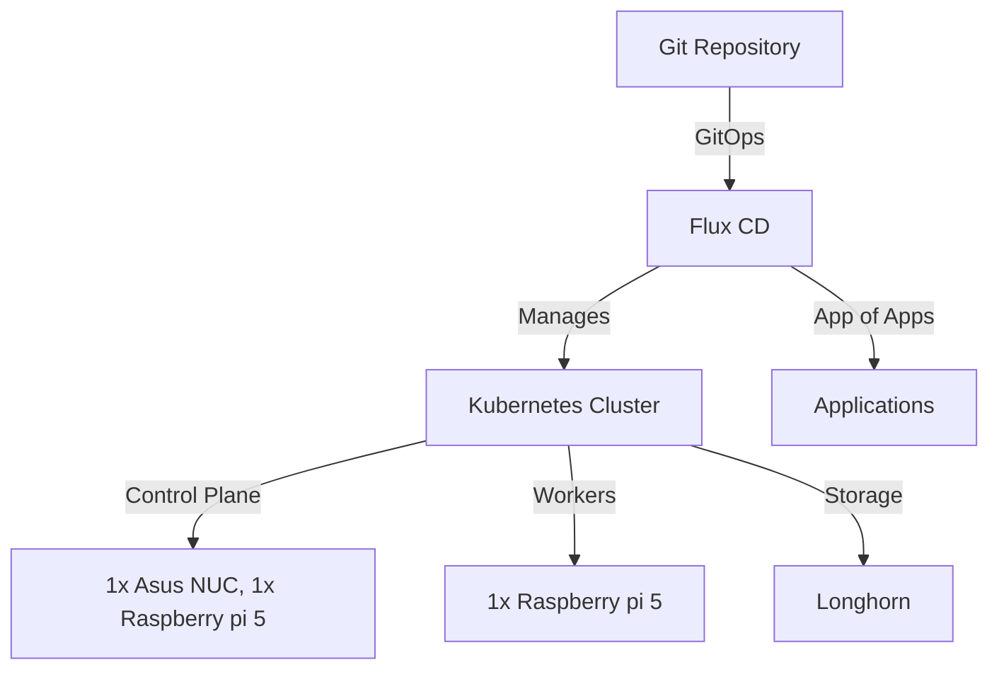

# 🏠 Home Lab Kubernetes Cluster


A bare-metal Kubernetes cluster running on TalOS Linux. Apps-of-apps pattern with FluxCD.

In my [Arcitectural decision record](./docs/arch-decisions/README.md) you can find my reasonings for decisions I take in the cluster.

## Infrastructure Overview

| Role | Model | CPU | RAM | SSD |
| ------------- | ------------- | -------------- | -------------- |-------|
| Controlplane | ASUS NUC 14 | N150 (4-cores) | 16GB (DDR5-5600) | Lexar SSD NM620 256GB for [Talos](./kubernetes/bootstrap/talos/talconfig.yaml) |
| Controlplane | Raspberry pi 5 | Cortex-A76 (4-cores) | 16GB (LPDDR4X-4267 SDRAM) | 64GB microSD for read-only root and boot, Lexar SSD NM620 256GB for [Talos](./kubernetes/bootstrap/talos/talconfig.yaml) |
| Workloads | Raspberry pi 5 | Cortex-A76 (4-cores) | 16GB (LPDDR4X-4267 SDRAM) | 64GB microSD for read-only root and boot, Lexar SSD NM620 256GB for [Talos](./kubernetes/bootstrap/talos/talconfig.yaml) |

### Software Stack
- **Base OS**: Talos Linux
- **Runtime**: Containerd
- **CSI**: Longhorn
- **GitOps Engine**: Flux CD
- **Observability (o11y)**: Prometheus, Grafana, Loki, Alertmanager, smartctl-exporter

### Network Stack
- **CNI**: Cilium
- **External LB**: Cilium/MetalLB/kube-vip/k8s-gateway CoreDNS plugin (TBD)
- **Ingress**: Envoy-gateway
- **DNS**: CoreDNS
- **Certificates**: Cert-manager, Let's encrypt

## 🏛️ Architecture


```mermaid
graph TD
    A[Git Repository] -->|GitOps| B[Flux CD]
    B -->|Manages| C[Kubernetes Cluster]
    C -->|Control Plane| D[1x Asus NUC, 1x Raspberry pi 5]
    C -->|Workers| E[1x Raspberry pi 5]
    C -->|Storage| F[Longhorn]
    B -->|App of Apps| G[Applications]
```

## Dependencies

```sh
pacman -S kubectl helm helmfile kustomize talosctl talhelper sops age cilium-cli
```

[flux-operator](https://github.com/controlplaneio-fluxcd/flux-operator/releases)

## Bootstrap cluster

[Guide](kubernetes/bootstrap/talos/README.md)

My IP plan before Cilium LB-IPAM is setup:

```
192.168.30.1                     - Gateway
192.168.30.2                     - DNS server
192.168.30.10                    - nuc-controlplane-1
192.168.30.12                    - pi5-controlplane-2
192.168.30.14                    - pi5-controlplane-3
192.168.30.16                    - pi5-worker-1
192.168.30.18                    - pi5-worker-2
192.168.30.20                    - pi4b-worker-3
192.168.30.100                   - TalOS VIP
192.168.30.110 -> 192.168.30.200 - CiliumLoadBalancerIPPool
192.168.30.240 -> 192.168.30.250 - DHCP
192.168.30.255                   - Broadcast addr
```

---

## Tools

This repository uses Mise to set up tooling locally. Follow this [guide](https://mise.jdx.dev/getting-started.html) to set it up.

Then install dependencies using the lockfile.

```sh
mise install --locked
```

## Other notes

[notes.md](./docs/notes.md)
