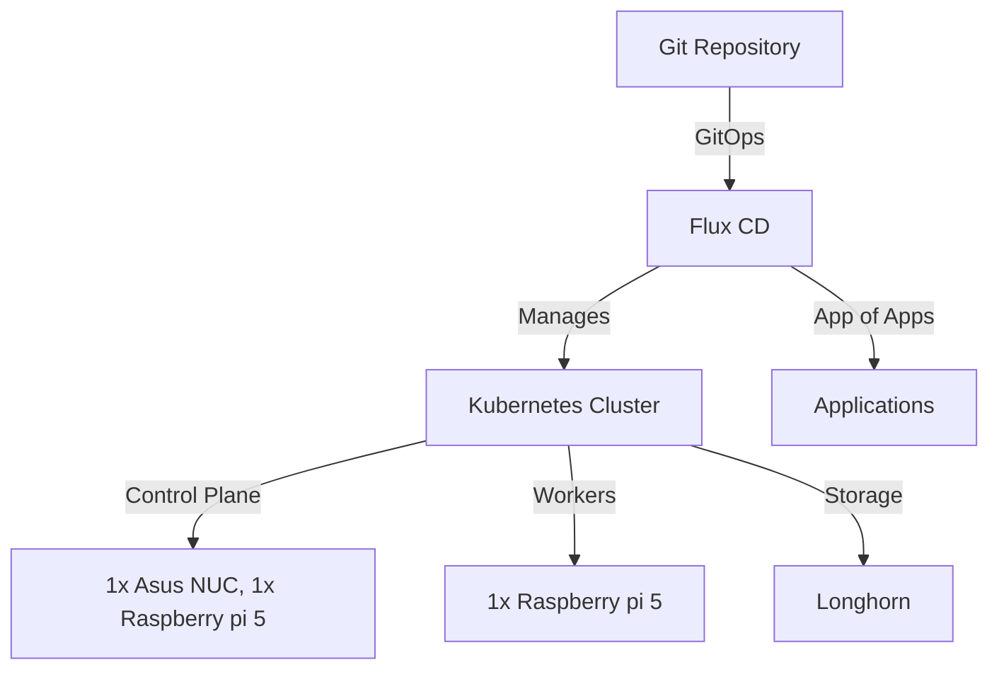

# 🏠 Home Lab Kubernetes Cluster


A bare-metal Kubernetes cluster running on TalOS Linux. Apps-of-apps pattern with FluxCD.

In my [Arcitectural decision record](./docs/arch-decisions/README.md) you can find my reasonings for decisions I take in the cluster.

## Infrastructure Overview

| Role | Model | CPU | RAM | SSD |
| ------------- | ------------- | -------------- | -------------- |-------|
| Controlplane | ASUS NUC 14 | N150 (4-cores) | 16GB (DDR5-5600) | Lexar SSD NM620 256GB for [Talos](./kubernetes/bootstrap/talos/talconfig.yaml) |
| Controlplane | Raspberry pi 5 | Cortex-A76 (4-cores) | 16GB (LPDDR4X-4267 SDRAM) | 64GB microSD for read-only root and boot, Lexar SSD NM620 256GB for [Talos](./kubernetes/bootstrap/talos/talconfig.yaml) |
| Workloads | Raspberry pi 5 | Cortex-A76 (4-cores) | 16GB (LPDDR4X-4267 SDRAM) | 64GB microSD for read-only root and boot, Lexar SSD NM620 256GB for [Talos](./kubernetes/bootstrap/talos/talconfig.yaml) |

### Software Stack
- **Base OS**: Talos Linux
- **Runtime**: Containerd
- **CSI**: Longhorn
- **GitOps Engine**: Flux CD
- **Observability (o11y)**: Prometheus, Grafana, Loki, Alertmanager, smartctl-exporter

### Network Stack
- **CNI**: Cilium
- **External LB**: Cilium/MetalLB/kube-vip/k8s-gateway CoreDNS plugin (TBD)
- **Ingress**: Envoy-gateway
- **DNS**: CoreDNS
- **Certificates**: Cert-manager, Let's encrypt

## 🏛️ Architecture


```mermaid
graph TD
    A[Git Repository] -->|GitOps| B[Flux CD]
    B -->|Manages| C[Kubernetes Cluster]
    C -->|Control Plane| D[1x Asus NUC, 1x Raspberry pi 5]
    C -->|Workers| E[1x Raspberry pi 5]
    C -->|Storage| F[Longhorn]
    B -->|App of Apps| G[Applications]
```

## Dependencies

```sh
pacman -S kubectl helm helmfile kustomize talosctl talhelper sops age cilium-cli
```

[flux-operator](https://github.com/controlplaneio-fluxcd/flux-operator/releases)

## Bootstrap cluster

[Guide](kubernetes/bootstrap/talos/README.md)

My IP plan before Cilium LB-IPAM is setup:

```
192.168.30.1                     - Gateway
192.168.30.2                     - DNS server
192.168.30.10                    - nuc-controlplane-1
192.168.30.12                    - pi5-controlplane-2
192.168.30.14                    - pi5-controlplane-3
192.168.30.16                    - pi5-worker-1
192.168.30.18                    - pi5-worker-2
192.168.30.20                    - pi4b-worker-3
192.168.30.100                   - TalOS VIP
192.168.30.240 -> 192.168.30.250 - DHCP
192.168.30.255                   - Broadcast addr
```

---

## Search for a helm release

[https://kubesearch.dev/](https://kubesearch.dev/)

## Security

Scan cluster for with [kubescape](https://github.com/kubescape/kubescape) to detect vulnerabilities and misconfiguration.

## Monitoring CPU temps

https://blog.medinvention.dev/k8s-cpu-temperature-fan-monitoring-for-rpi/

[Credit](https://github.com/mmohamed/k8s-raspberry/blob/66c9a74d7155f1766ea4dfe143b45a119bb28678/s2i/k8s-monitoring/api.yaml#L177

```yaml
---
apiVersion: apps/v1
kind: DaemonSet
metadata:
  name: monitoring-agent
  namespace: monitoring
  labels:
    k8s-app: monitoring-agent
spec:
  selector:
    matchLabels:
      name: monitoring-agent
  template:
    metadata:
      labels:
        name: monitoring-agent
        commit: '{{commit}}'
    spec:
      tolerations:
      # this toleration is to have the daemonset runnable on master nodes
      # remove it if your masters can't run pods
      - key: node-role.kubernetes.io/master
        effect: NoSchedule
      containers:
      - name: monitoring-agent
        image: busybox
        env:
          - name: NODE
            valueFrom:
              fieldRef:
                fieldPath: spec.nodeName
          - name: SERVER
            value: http://monitoring-service.monitoring.svc.k8s.local/k8s/collect/{{token}}/temperature
        command: [ "sh", "-c"]
        args:
        - while true; do
            TEMP=$(cat /sys/class/thermal/thermal_zone0/temp);
            URL="$SERVER?node=$NODE&value=$TEMP";
            wget -qO- $URL;
            sleep 5;
          done;
        imagePullPolicy: IfNotPresent

```

### How to generate system extensions with TalOS

https://docs.siderolabs.com/talos/v1.13/platform-specific-installations/boot-assets#example%3A-bare-metal-with-image-factory

```bash
curl -X POST --data-binary @./longhorn/system-extensions.yaml https://factory.talos.dev/schematics

talosctl upgrade --image \
factory.talos.dev/metal-installer/<schematic_id>:v1.13.4
```

Verify with `talosctl get extensions` after the node is up and running again

## Longhorn

[Best practices with longhorn](https://longhorn.io/docs/1.10.0/best-practices/)

- "Longhorn relies heavily on kernel functionality and performs better on some kernel versions."

**Be careful with kernel upgrades** - make sure backups work.

[Useful article](https://phin3has.blog/posts/talos-longhorn/)

[Longhorn StorageClass parameters](https://longhorn.io/docs/1.12.0/references/storage-class-parameters/)

[Setting a backup target for longhorn](https://longhorn.io/docs/1.12.0/snapshots-and-backups/backup-and-restore/set-backup-target/#default-backup-target)

Todo: Plan is to set up a backup target locally on the cluster with MinIO S3 aswell as an off-shore backup in the futureTM.

## Backups and Disaster recovery plan

Take regular backups and test restoring backups in a local k8s cluster

**Todo:** Set up TalOS in VMs and provision the cluster and test that a selection of the data works as expected (restoring all data will take a loong time)

**Todo:** Set up backups and DR plan

https://longhorn.io/docs/1.10.0/snapshots-and-backups/backup-and-restore/create-a-backup/#incremental-backup

## Talhelper

[docs](https://budimanjojo.github.io/talhelper/latest/getting-started/)

> Do not update or change your talsecret.sops.yaml file once you have a working cluster unless you want to recreate a new cluster or know what you're doing as you will break the cluster and lose access to it.

> Running talhelper genconfig will request a brand new talosconfig that is valid for 365 days since the time you run the command. This means the content of the file will be different everytime. This is the equivalent to [Generating new client configuration](https://docs.siderolabs.com/talos/v1.13/security/cert-management#generating-new-client-configuration) that you can use to re-request a new client configuration.

## Sops

Use sops to encrypt secrets to store in git.

```sh
sops -e talsecret.yaml > talsecret.sops.yaml

# Keep unencrypted file in talsecret so it is ignored by git.
sops -d talsecret.sops.yaml > talsecret.yaml
```

[Setup sops](https://budimanjojo.github.io/talhelper/latest/guides/#configuring-sops-for-talhelper)

[How to use sops in manifests and patches](https://budimanjojo.github.io/talhelper/latest/guides/#using-sops-encrypted-files-in-manifests-and-patches)

## Sealed secrets

Sealing a secret:

```bash
kubectl create secret generic test --dry-run=client --from-literal=key=value -o yaml | kubeseal --controller-namespace sealed-secrets --format yaml -w sealed-secret.yaml
```

## Services to consider

- Local LLM like Qwen / Glm 4.5 air / Claude Sonnet 4.5 Thinking. Requirements: 1 or more GPUs with 24GB+ VRAM (A100, H100, 3090, etc.)

[More info on selfhosted LLMs](https://www.reddit.com/r/LocalLLM/comments/1otaaj8/if_people_understood_how_good_local_llms_are/)
