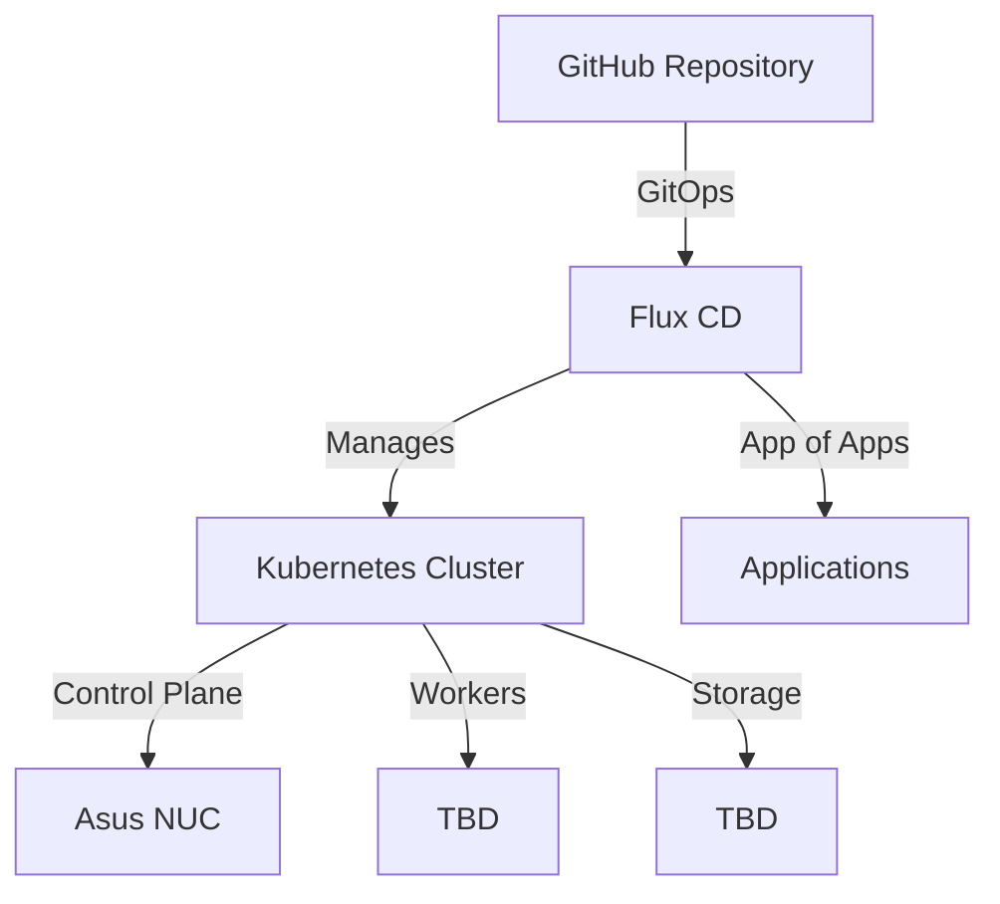

# 🏠 Home Lab Kubernetes Cluster


A fully automated, GitOps-managed Kubernetes cluster running bare-metal with Talos Linux.

## Infrastructure Overview

### 👷 Hardware
- **Control Plane**: 1x Asus NUC 14 Pro
- **Worker nodes**: TBD
- **Storage**: TBD - DIY network attached storage

### Software Stack
- **Base OS**: Talos Linux
- **Container Orchestration**: Kubernetes
- **GitOps Engine**: Flux CD
- **Storage**: TBD - 5x 4TB raidz2 ZFS

## 🌟 Key Features

- **GitOps-First Approach**: All cluster configurations and applications are managed through Git using the App of Apps pattern
- **Declarative Configuration**: Everything-as-code philosophy
- **Automated Deployments**: Changes to this repository automatically sync to the cluster via Argo CD
- **Persistent Storage**: TBD - Longhorn block storage for random R/W, NAS RAID for long-term

## 🏛️ Architecture



## 📦 Components

- **Cluster OS**: Talos Linux with system extensions
- **Networking**: MetalLB + Traefik
- **Storage**: TBD
- **GitOps**: Flux CD with App of Apps pattern

---

### How to generate system extensions with TalOS

https://docs.siderolabs.com/talos/v1.11/platform-specific-installations/boot-assets#example%3A-bare-metal-with-image-factory

```bash
curl -X POST --data-binary @./longhorn/system-extensions.yaml https://factory.talos.dev/schematics

talosctl upgrade --image \
factory.talos.dev/metal-installer/<schematic_id>:v1.11.3
```

Verify with `talosctl get extensions` after the node is up and running again

## Longhorn

[Best practices with longhorn](https://longhorn.io/docs/1.10.0/best-practices/)

- "Longhorn relies heavily on kernel functionality and performs better on some kernel versions."

**Be careful with kernel upgrades** - make sure backups work.

## Backups and Disaster recovery plan

Take regular backups and test restoring backups in a local k8s cluster

**Todo:** Set up TalOS in VMs and provision the cluster and test that a selection of the data works as expected (restoring all data will take a loong time)

**Todo:** Set up backups and DR plan

https://longhorn.io/docs/1.10.0/snapshots-and-backups/backup-and-restore/create-a-backup/#incremental-backup

## Services to install

- Local LLM like Qwen / Glm 4.5 air / Claude Sonnet 4.5 Thinking. Requirements: 1 or more GPUs with 24GB+ VRAM (A100, H100, 3090, etc.)

[More info on selfhosted LLMs](https://www.reddit.com/r/LocalLLM/comments/1otaaj8/if_people_understood_how_good_local_llms_are/)

## Sealed secrets

Sealing a secret:

```bash
kubectl create secret generic test --dry-run=client --from-literal=key=value -o yaml | kubeseal --controller-namespace sealed-secrets --format yaml -w sealed-secret.yaml
```
